# MQTT Broker Project

A custom, high-performance MQTT 3.1.1 compliant broker implementation in Java. This project demonstrates advanced
software design patterns and low-level network programming without reliance on heavy frameworks like Spring Boot or
Netty. It is designed for educational purposes to showcase architectural patterns "from scratch".

## 1. Physical Architecture

The broker is designed to operate in a networked environment, typically deployed on a central server to manage
communication between various IoT clients.

**Deployment Topology:**

* **Host**: The broker runs on a JVM-enabled machine (Server/Workstation).
* **Protocol**: Uses TCP/IP for reliable transport.
* **Port**: Listens on port `1883` (Standard MQTT) by default.
* **Clients**: Accepts connections from any MQTT 3.1.1 compliant client (Sensors, Mobile Apps, Dashboards).

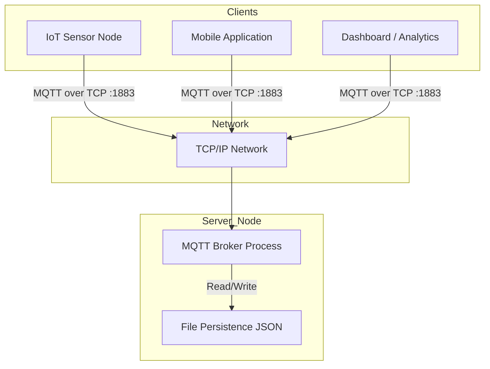

## 2. Logical Architecture

The application follows a **Reactor-like** event-driven architecture powered by Java NIO (Non-blocking I/O). It is
structured into distinct logical layers to ensure separation of concerns.

1. **Network Layer**: Managed by `ServerListener` and the main `Broker` loop. It handles the `Selector`, accepts
   `SocketChannel` connections, and manages raw byte reads/writes.
2. **Protocol Layer**: `Decoder` and `Encoder` classes translate between raw `ByteBuffer` data and Java POJOs (
   `MqttPacket` records).
3. **Dispatcher Layer**: The `MqttPacketHandler` acts as a central router, inspecting the packet type and delegating to
   the appropriate business logic handler.
4. **Domain/Business Layer**: Contains the core logic:
    * **Authorization**: Verifies credentials and permissions.
    * **Topic Tree**: A Trie data structure for efficient subscription matching.
    * **Session Management**: Handles persistent sessions and message queuing.
5. **Event System**: A synchronous event bus (`BrokerEventPublisher`) that decouples the main processing loop from side
   effects like logging, metrics, or complex inter-component notifications.

## 3. Implemented Design Patterns

The following design patterns were implemented **from scratch** to solve specific architectural challenges.

### A. Strategy Pattern

**Location**:

- **Context**: `src/main/java/com/mqtt/broker/auth/AuthorizationService.java`
- **Interface**: `src/main/java/com/mqtt/broker/auth/strategy/AuthorizationStrategy.java`
- **Implementations**: `FileBasedAuthorizationStrategy`, `PermissiveAuthorizationStrategy`

**Justification**:
The Strategy pattern allows the broker's authentication mechanism to be swapped at runtime based on configuration.

- **Problem**: We need strict authentication for production but open access for local testing. Hardcoding one logic path
  creates technical debt.
- **Solution**: The `AuthorizationService` holds a reference to the `AuthorizationStrategy` interface. At startup,
  depending on the `allowAnonymous` flag in `application.yml`, the system injects either the `FileBased` (checks
  `users.json`) or `Permissive` (allows all) strategy.

**Diagram**:

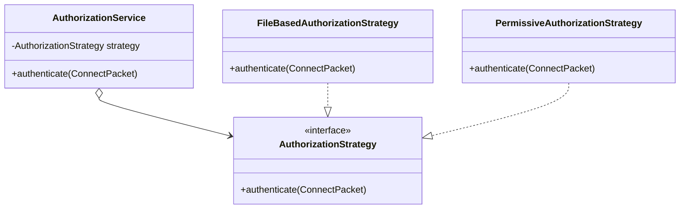

**Trade-offs**:

- **Complexity**: Increases the number of classes (one interface + multiple implementation classes).
- **Configuration Overhead**: Requires a mechanism to choose the correct strategy at runtime.

### B. Observer Pattern

**Location**:

- **Subject**: `src/main/java/com/mqtt/broker/event/BrokerEventPublisher.java`
- **Observer Interface**: `src/main/java/com/mqtt/broker/event/EventListener.java`
- **Concrete Observers**: `ConnectionEventListener`, `DeliveryEventListener`, `SubscriptionEventListener`

**Justification**:
The broker needs to perform auxiliary tasks (logging, updating stats, cleaning up resources) when state changes occur,
without polluting the core packet processing logic.

- **Problem**: Adding logging or metrics directly into `ConnectPacketHandler` violates the **Single Responsibility
  Principle**.
- **Solution**: The core handlers publish events (e.g., `ClientConnectedEvent`) via the `BrokerEventPublisher`.
  Independent listeners subscribe to these events. This makes the system extensible; adding a new metric collector
  requires no changes to the core business logic.

**Diagram**:

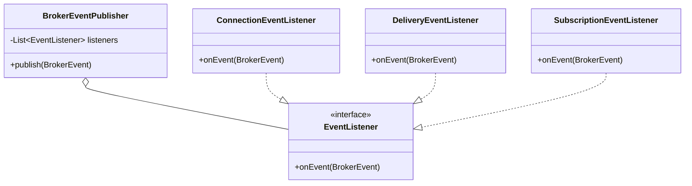

**Trade-offs**:

- **Debugging Difficulty**: The flow of control is inverted; it can be hard to trace "who" reacted to an event.
- **Ordering Issues**: Observers are notified in an arbitrary order, which can lead to race conditions if dependencies
  exist between listeners. In this case those issues do not arise due to the independent design of listeners.

### C. Command Pattern (Dispatcher)

**Location**:

- **Invoker**: `src/main/java/com/mqtt/broker/handler/MqttPacketHandler.java`
- **Command Interface**: `src/main/java/com/mqtt/broker/handler/PacketHandler.java`
- **Concrete Commands**: `ConnectPacketHandler`, `PublishPacketHandler`, `SubscribePacketHandler`, etc.

**Justification**:
MQTT has distinct packet types that require unique processing logic.

- **Problem**: Handling all packet types in a massive `switch` or `if-else` block leads to a "God Class" and violates
  the **Open/Closed Principle**.
- **Solution**: We map each `MqttPacketType` to a specific `PacketHandler`. The `MqttPacketHandler` identifies the type
  and calls `handle()`. Adding a new packet type (e.g., for MQTT 5.0) involves simply creating a new class and
  registering it, without modifying the dispatching mechanism.

**Diagram**:

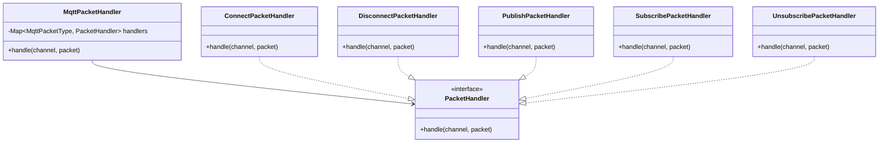

**Continuation...**:

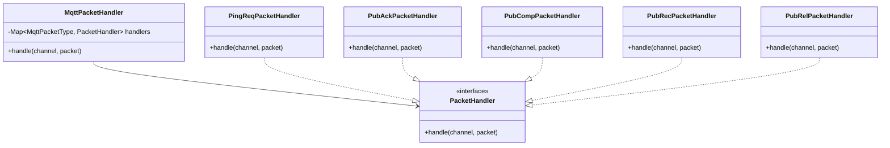

**Trade-offs**:

- **Class Explosion**: Requires a separate class for every command (packet type), leading to a large number of files.
- **Indirection**: Adds a layer of abstraction that might seem overkill for simple commands.

### D. Chain of Responsibility Pattern (Pipeline)

**Location**:

- **Chain Interface**: `src/main/java/com/mqtt/broker/interceptor/Interceptor.java`
- **Base Handler**: `src/main/java/com/mqtt/broker/interceptor/ChainablePacketInterceptor.java`
- **Pipeline Manager**: `src/main/java/com/mqtt/broker/interceptor/PacketProcessingPipeline.java`
- **Concrete Handlers**: `ResponseSendingInterceptor`, `EventPublishingInterceptor`, `ClientActivityInterceptor`,
  `PacketAuthorizationInterceptor`, `PacketHandlingInterceptor`

**Justification**:
The broker requires multiple independent processing steps for every packet: Response Sending -> Event Publishing ->
Activity Tracking -> Authorization -> Handling.

- **Problem**: Hardcoding these calls in the `Broker` creates strong coupling. Some steps are "wrappers" (side-effects
  like sending response) while others are "filters" (auth, handling).
- **Solution**: We implement a processing pipeline.
    - **Wrappers** (`ResponseSendingInterceptor`, `EventPublishingInterceptor`) implement `Interceptor` directly and
      wrap the execution of the rest of the chain, acting on the return value (Result).
    - **Filters** (`PacketHandlingInterceptor`) extend `ChainablePacketInterceptor` and focus on processing logic,
      potentially short-circuiting the chain.

**Diagram**:

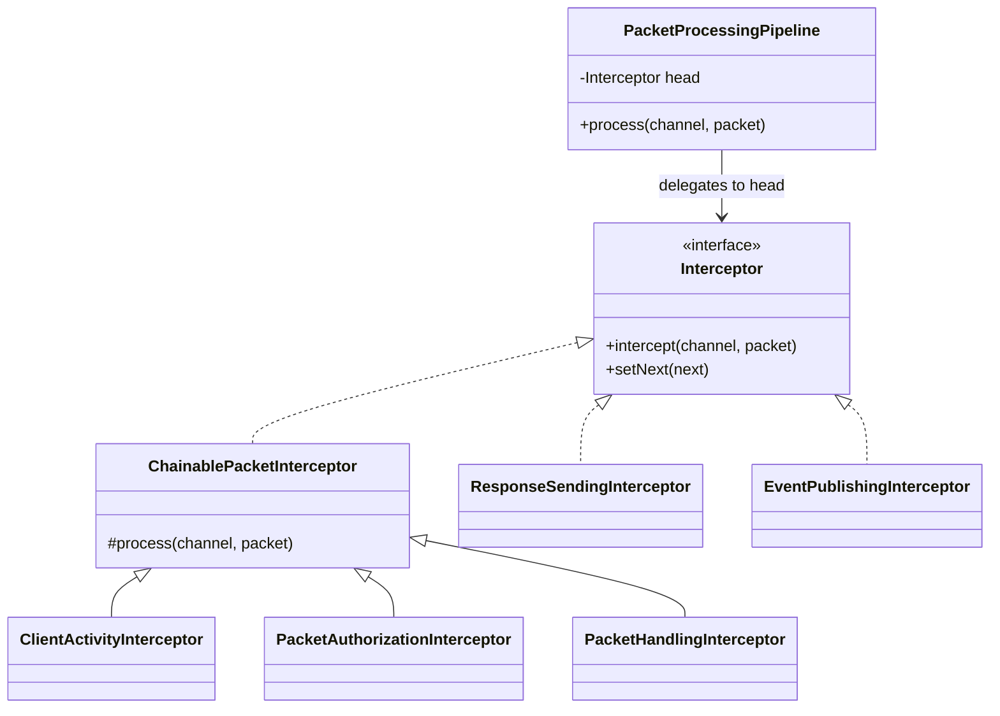

**Trade-offs**:

- **Performance Overhead**: Passing a request down a long chain involves many method calls.
- **Order Dependency**: The pipeline relies heavily on the correct order of interceptors (e.g., Auth must come before
  Handling).
-   **Debugging**: It can be difficult to pinpoint which interceptor stopped the chain or modified the request.

### E. Builder Pattern
**Location**:
-   **Broker Construction**: `src/main/java/com/mqtt/broker/BrokerBuilder.java`
-   **Event System**: `src/main/java/com/mqtt/broker/event/BrokerEventPublisher.java`
-   **Pipeline**: `src/main/java/com/mqtt/broker/interceptor/PacketProcessingPipeline.java`

**Justification**:
Complex objects like the `Broker` or the processing `Pipeline` have many optional dependencies or configuration steps.
-   **Problem**: Using a constructor with many parameters (Telescoping Constructor Anti-pattern) is unreadable and error-prone. Passing `null` for optional dependencies is confusing.
-   **Solution**: We use the Builder pattern to construct these objects step-by-step. This provides a fluent API, allows for sensible defaults (e.g., default `MqttPacketDecoder`), and ensures the final object is fully initialized and immutable where possible.

**Diagram**:
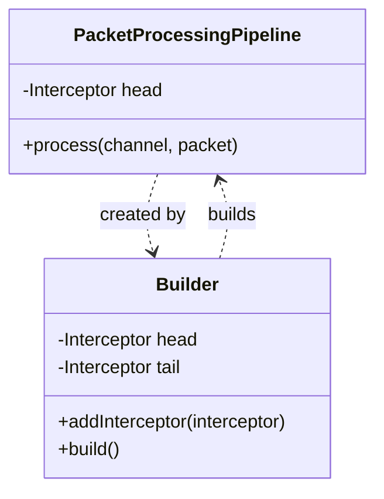

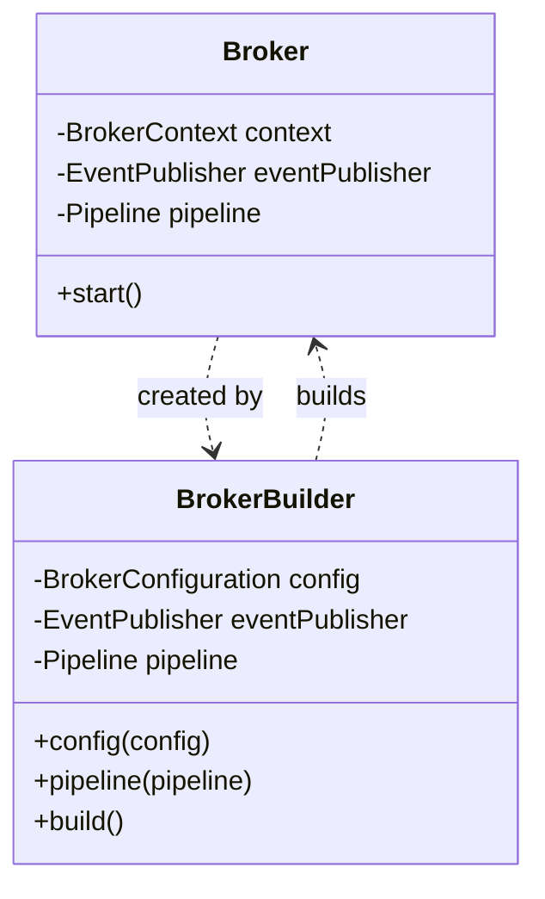

**Trade-offs**:
-   **Verbosity**: Requires creating a separate inner static class or external builder class, doubling the lines of code for that type.
-   **Duplicate Fields**: The Builder usually mirrors the fields of the target class, leading to duplication.

## 4. Visual Diagrams (UML)

### A. UML Class Diagram (Core System)

This diagram highlights the relationship between the central Broker, the networking layer, and the core processing
components.

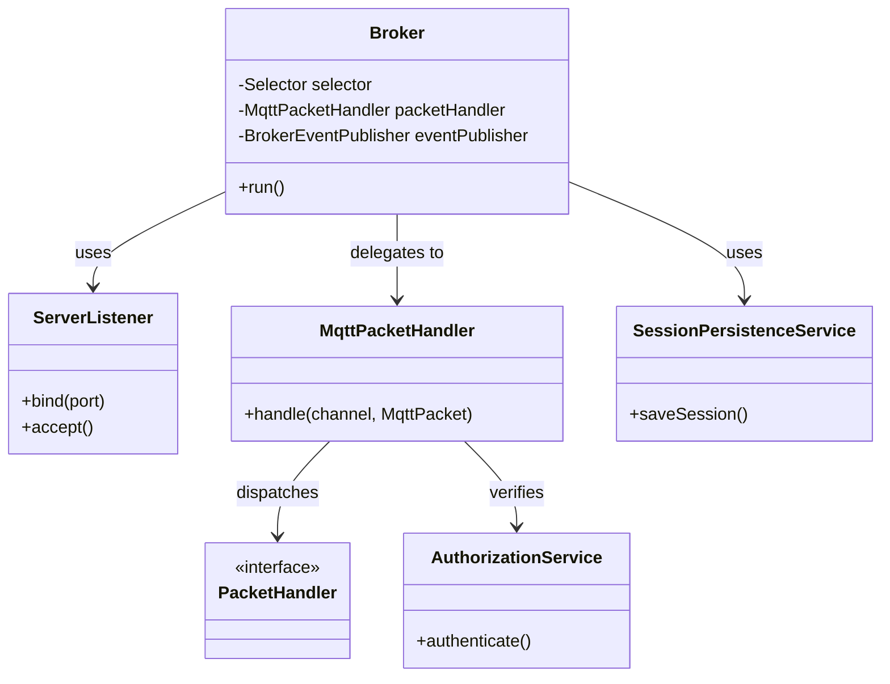

### B. Sequence Diagram: Client Connection Flow

This diagram illustrates the interaction between components when a client connects.

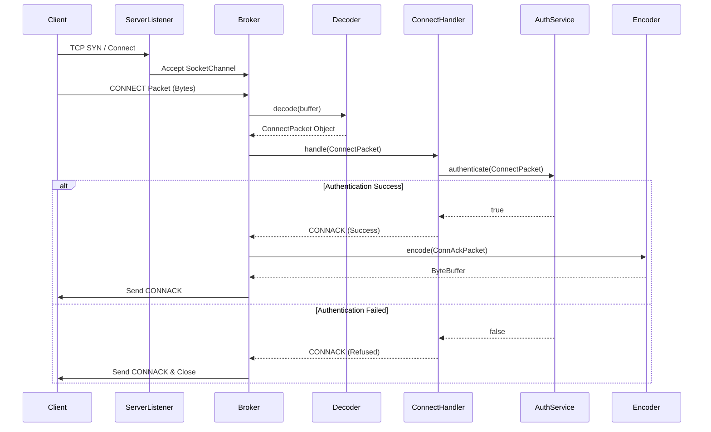

### C. Activity Diagram: Packet Processing Pipeline

The lifecycle of an incoming packet from network read to response.

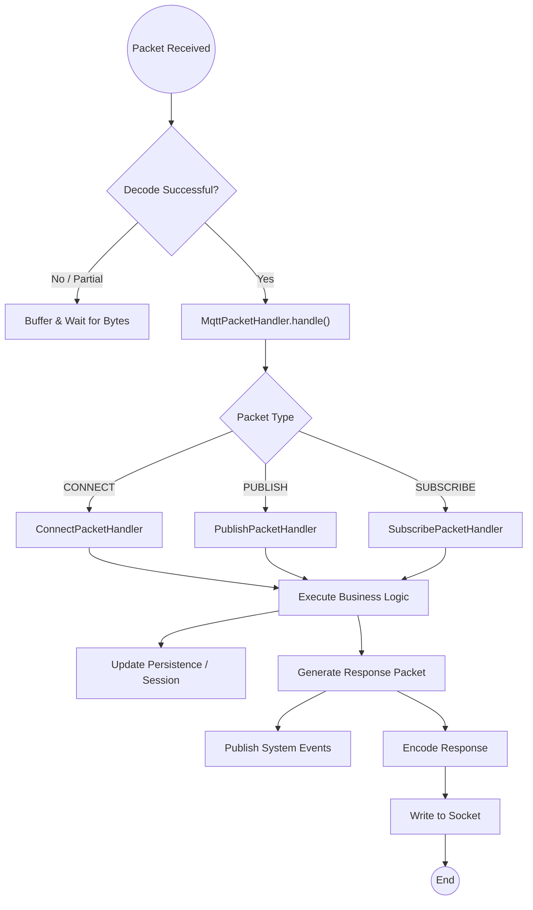

## 5. Configuration & Persistence

The broker behavior is controlled via configuration files and persistent storage located in the root directory.

### Configuration (`application.yml`)

Located at the **project root** (`application.yml`). Controls server settings.

* **allowAnonymous**:
    * `true`: Uses `PermissiveAuthorizationStrategy` (No credentials required).
    * `false`: Uses `FileBasedAuthorizationStrategy` (Validates against `users.json`).
* **port**: The TCP port (default: 1883).
* **cleanSession**: Default behavior for new sessions.

### User Repository (`users.json`)

Used when `allowAnonymous: false`. Defines valid users and their topic permissions.

```json
[
  {
    "username": "user",
    "password": "password",
    "permissions": [
      {
        "topic": "readwrite/#",
        "access": "READ_WRITE"
      }
    ]
  }
]
```

### Session Persistence (`sessions.json`)

Stores active sessions, subscriptions, and queued messages. This ensures that if the broker restarts, persistent
sessions (clients with `cleanSession=false`) do not lose their state or queued messages. This file is updated at runtime
by the `SessionPersistenceService`.

## 6. Running the Broker

### Prerequisites

* Java 21 or higher (Project configured for Java 25 features).
* Maven (Wrapper included).

### Execution Steps

1. **Clone the repository**:
   ```bash
   git clone <repository-url>
   cd mqtt-broker
   ```

2. **Run the application**:
   Use the Maven wrapper to clean, compile, and execute the main class.

   **On macOS / Linux**:
   ```bash
   ./mvnw clean compile exec:java
   ```

   **On Windows**:
   ```cmd
   mvnw.cmd clean compile exec:java
   ```

The broker will start up and log "Broker started on port 1883".

## 7. Testing

To verify functionality, use an MQTT Client like **MQTTX**:

1. Open MQTTX.
2. Create a connection to `localhost` on port `1883`.
3. If `allowAnonymous: false`, provide a username/password from `users.json`.
4. Connect and try publishing/subscribing to topics.
