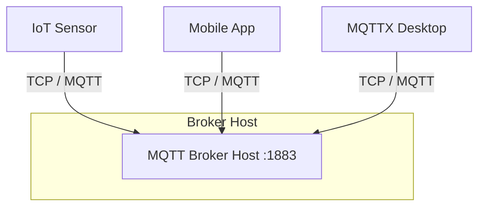
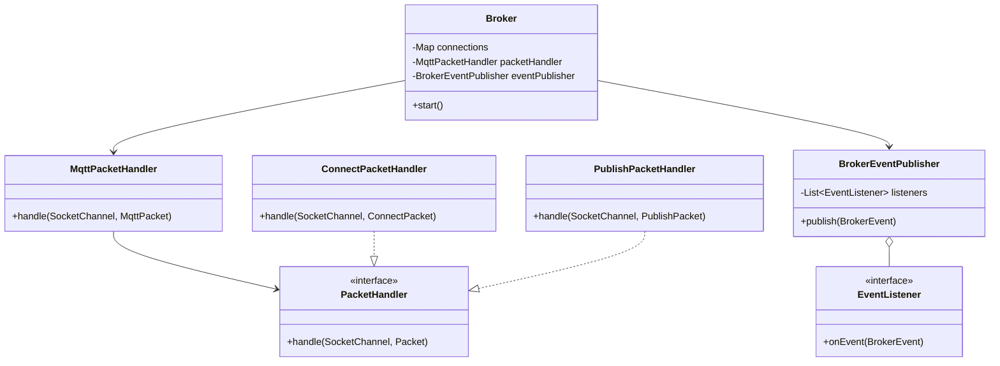
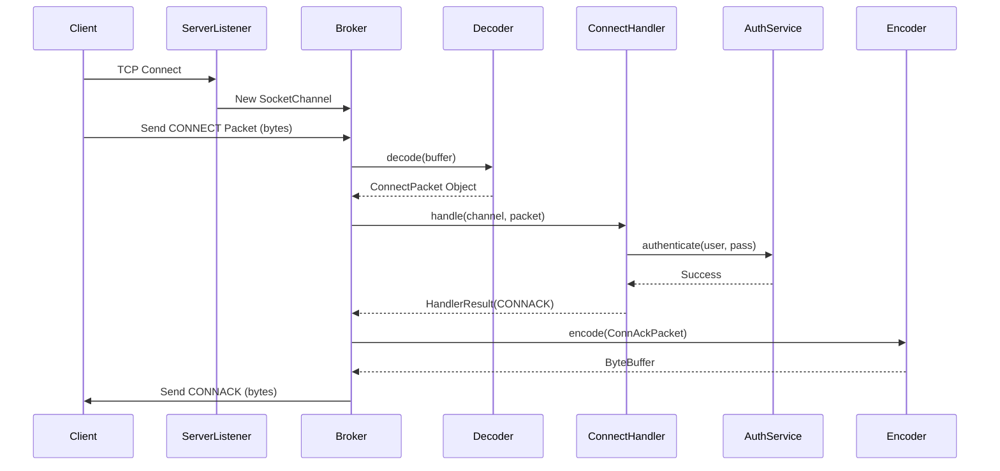
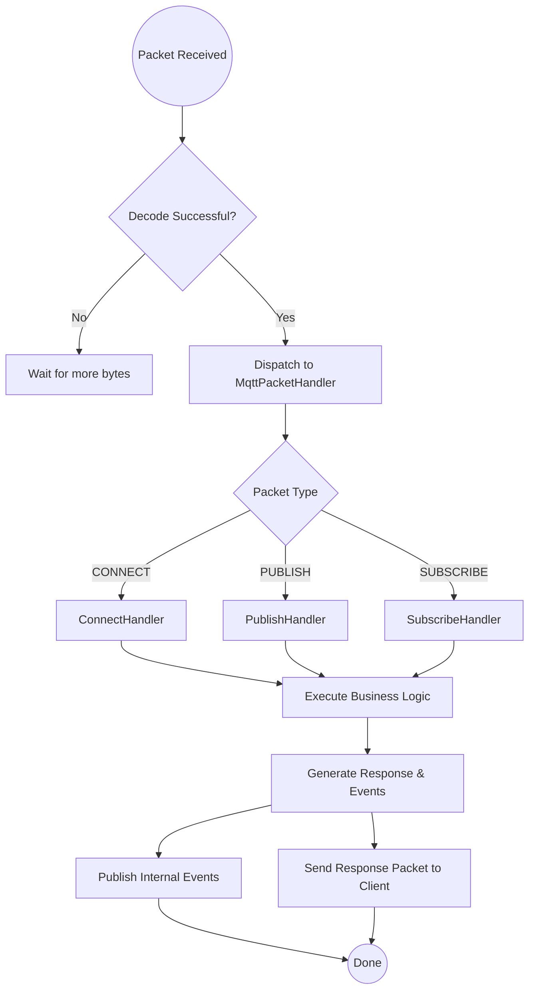

# MQTT Broker Project

A custom, high-performance MQTT 3.1.1 compliant broker implementation in Java. This project demonstrates advanced software design patterns and low-level network programming without reliance on heavy frameworks.

## 1. Physical Architecture

The broker is designed to operate in a networked environment, listening for TCP connections from MQTT clients.

**Deployment Topology:**
*   **Node**: The broker runs on a host machine (Server/Workstation).
*   **Network**: Uses standard TCP/IP networking.
*   **Port**: Listens on port `1883` (default MQTT non-SSL port) for incoming client connections.
*   **Clients**: Can accept connections from any MQTT 3.1.1 compliant client (e.g., IoT devices, Mobile Apps, Desktop Clients like MQTTX).



## 2. Logical Architecture

The application follows a **Reactor-like** event-driven architecture powered by Java NIO (Non-blocking I/O). It is structured into distinct logical layers to ensure separation of concerns.

*   **Network Layer**: `ServerListener` and `Broker` loop manage the `Selector`. They handle raw bytes and maintain open `SocketChannel` connections.
*   **Protocol Layer**: `Decoder` and `Encoder` classes translate between raw byte buffers and Java POJOs (`MqttPacket` records).
*   **Handler Layer**: The `MqttPacketHandler` acts as a central dispatcher, routing packets to specific handlers (e.g., `ConnectPacketHandler`, `PublishPacketHandler`).
*   **Core Domain**: Contains the business logic, including `AuthorizationService`, `SubscriptionRepository`, and the `TopicTree` (Trie) for topic matching.
*   **Event System**: A synchronous event bus (`BrokerEventPublisher`) that decouples the main processing loop from side effects like logging or stats updates.

## 3. Implemented Design Patterns

The following design patterns were implemented from scratch to solve specific architectural challenges.

### A. Strategy Pattern
**Location**: 
- `src/main/java/com/mqtt/broker/auth/strategy/AuthorizationStrategy.java` (Interface)
- `src/main/java/com/mqtt/broker/trie/strategy/TrieStrategy.java` (Interface)

**Justification**: 
The Strategy pattern was chosen to allow the broker's behavior to be swapped at runtime or configuration time without modifying the core logic. 
1.  **Authorization**: We support multiple auth mechanisms (e.g., `FileBasedAuthorizationStrategy` for production-like envs vs `PermissiveAuthorizationStrategy` for testing). The `AuthorizationService` delegates the actual check to the configured strategy.
2.  **Topic Tree Operations**: The Trie data structure uses strategies (`SubscriptionInsertionStrategy`, `SubscriptionPruningStrategy`) to define how the tree is traversed and modified. This isolates the complex recursive logic of tree manipulation from the data structure itself.

### B. Observer Pattern
**Location**: 
- `src/main/java/com/mqtt/broker/event/BrokerEventPublisher.java` (Subject)
- `src/main/java/com/mqtt/broker/event/EventListener.java` (Observer Interface)

**Justification**: 
The broker performs many critical actions (Client Connected, Message Published, Connection Lost). Hardcoding the reactions to these events (logging, metrics, cleanup) inside the main processing loop would violate the **Single Responsibility Principle**. 
The Observer pattern allows the core system to simply "announce" that something happened. Multiple listeners (`ConnectionEventListener`, `DeliveryEventListener`) subscribe to these events and handle side effects independently. This makes the system highly extensible; adding a new logging metric doesn't require touching the packet handling logic.

### C. Command Pattern (Dispatcher)
**Location**: 
- `src/main/java/com/mqtt/broker/handler/MqttPacketHandler.java` (Invoker/Dispatcher)
- `src/main/java/com/mqtt/broker/handler/PacketHandler.java` (Command Interface)

**Justification**: 
MQTT has many distinct packet types (CONNECT, PUBLISH, SUBSCRIBE), each requiring unique processing logic. 
Instead of a massive `if-else` block inside the main loop, we use a variation of the Command pattern. The `MqttPacketHandler` identifies the packet type and delegates execution to a specific `PacketHandler` implementation. This adheres to the **Open/Closed Principle**: adding support for a new packet type (if the protocol evolved) would only require adding a new Handler class, not modifying the existing complex logic.

## 4. Visual Diagrams (UML)

### A. UML Class Diagram (Core Components)



### B. Sequence Diagram: Connection Flow

This diagram illustrates the process when a client attempts to connect to the broker.



### C. Activity Diagram: General Packet Processing Pipeline



---

## 5. Running the Broker

### Prerequisites
- Java 21 or higher
- Maven

### Execution

To run the broker, execute the following command from the root directory:

**macOS / Linux**
```sh
./mvnw clean compile exec:java
```

**Windows**
```sh
mvnw.cmd clean compile exec:java
```

The broker will start and listen for connections on `localhost:1883`.

## 6. Testing

You can test the broker using **MQTTX**:

1.  Download [MQTTX](https://mqttx.app/).
2.  Create a "New Connection".
    *   **Host**: `localhost`
    *   **Port**: `1883`
    *   **Protocol**: MQTT 3.1.1
3.  Click "Connect".

If successful, the broker logs will show a `ClientConnectedEvent` and MQTTX will show "Connected".