# MQTT Broker Project

A custom, high-performance MQTT 3.1.1 compliant broker implementation in Java. This project demonstrates advanced
software design patterns and low-level network programming without reliance on heavy frameworks like Spring Boot or
Netty. It is designed for educational purposes to showcase architectural patterns "from scratch".

## 1. Physical Architecture

The broker is designed to operate in a networked environment, typically deployed on a central server to manage
communication between various IoT clients.

**Deployment Topology:**

* **Host**: The broker runs on a JVM-enabled machine (Server/Workstation).
* **Protocol**: Uses TCP/IP for reliable transport.
* **Port**: Listens on port `1883` (Standard MQTT) by default.
* **Clients**: Accepts connections from any MQTT 3.1.1 compliant client (Sensors, Mobile Apps, Dashboards).

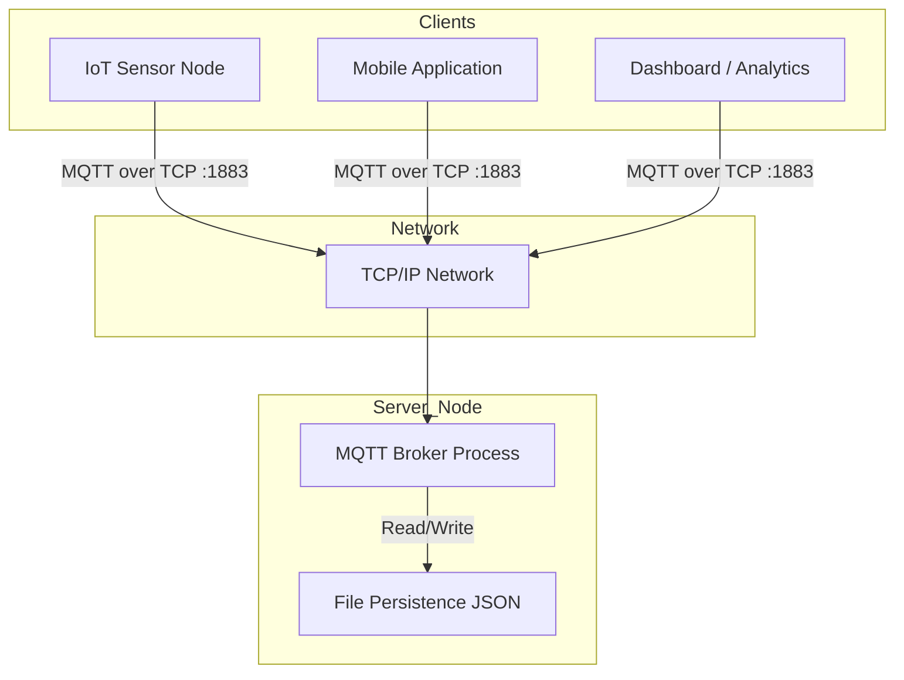

## 2. Logical Architecture

The application follows a **Reactor-like** event-driven architecture powered by Java NIO (Non-blocking I/O). It is
structured into distinct logical layers to ensure separation of concerns.

1. **Network Layer**: Managed by `ServerListener` and the main `Broker` loop. It handles the `Selector`, accepts
   `SocketChannel` connections, and manages raw byte reads/writes.
2. **Protocol Layer**: `Decoder` and `Encoder` classes translate between raw `ByteBuffer` data and Java POJOs (
   `MqttPacket` records).
3. **Dispatcher Layer**: The `MqttPacketHandler` acts as a central router, inspecting the packet type and delegating to
   the appropriate business logic handler.
4. **Domain/Business Layer**: Contains the core logic:
    * **Authorization**: Verifies credentials and permissions.
    * **Topic Tree**: A Trie data structure for efficient subscription matching.
    * **Session Management**: Handles persistent sessions and message queuing.
5. **Event System**: A synchronous event bus (`BrokerEventPublisher`) that decouples the main processing loop from side
   effects like logging, metrics, or complex inter-component notifications.

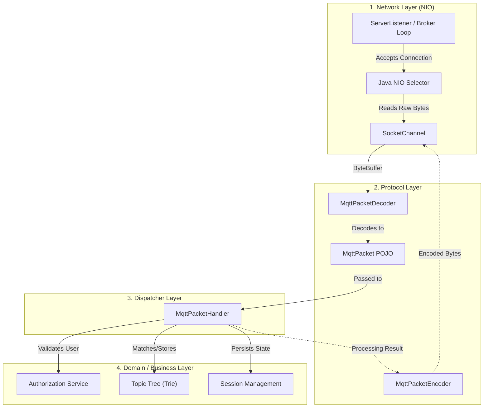

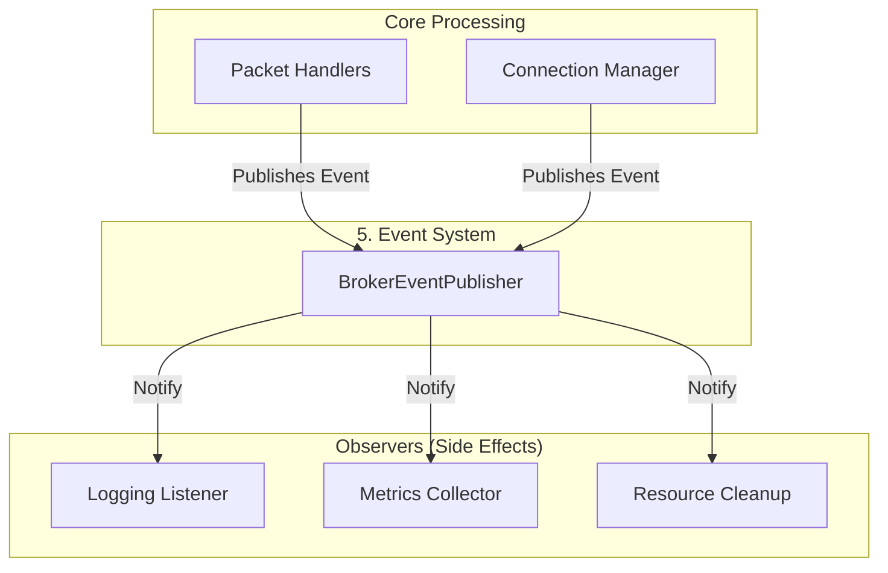

## 3. Implemented Design Patterns

The following design patterns were implemented **from scratch** to solve specific architectural challenges.

### A. Strategy Pattern

The Strategy pattern is a cornerstone of our architecture, appearing in multiple subsystems to decouple high-level business logic from interchangeable low-level algorithms. We employ it in two distinct scenarios:

#### 1. Authorization Strategy

**Location**:

*   **Context (`Context`)**: `src/main/java/com/mqtt/broker/authorization/AuthorizationService.java`
*   **Strategy Interface (`Strategy`)**: `src/main/java/com/mqtt/broker/authorization/strategy/AuthorizationStrategy.java`
*   **Concrete Strategies (`ConcreteStrategy`)**: `FileBasedAuthorizationStrategy`, `PermissiveAuthorizationStrategy`

**Motivation (Algorithmic Justification)**:
We utilize the Strategy Pattern to encapsulate fundamentally different **validation algorithms**, not just data variations. While the input (username/password) remains constant, the computational logic required to process that input varies significantly between environments:

1.  **Permissive Strategy (Development)**:
    *   **Algorithm**: No-op / Constant Time O(1).
    *   **Logic**: Blindly accepts all connections and grants full permissions. It bypasses all verification logic.
    *   **Use Case**: Local testing, benchmarking where security overhead is undesirable.

2.  **File-Based Strategy (Production)**:
    *   **Algorithm**: I/O Bound Search & Match.
    *   **Logic**: Involves file system I/O, JSON deserialization (`UserRegistry`), and iterative permission matching against a repository.
    *   **Use Case**: Production environments requiring persistent credential constraints.

This distinction is critical: The broker's core logic (`AuthorizationService`) functions independently of whether the underlying validation requires a simple boolean return or a complex disk read operation.

**Implementation**:
The `AuthorizationStrategy` interface defines the contract that decouples the Broker (Context) from the authentication mechanism:

```java
public interface AuthorizationStrategy {
    boolean authenticate(ConnectPacket packet);
    boolean canSubscribe(String username, String topic);
    boolean canPublish(String username, String topic);
}
```

The **Context** (`AuthorizationService`) delegates to this interface. It treats authentication as a "black box" operation, adhering to the **Open/Closed Principle**.


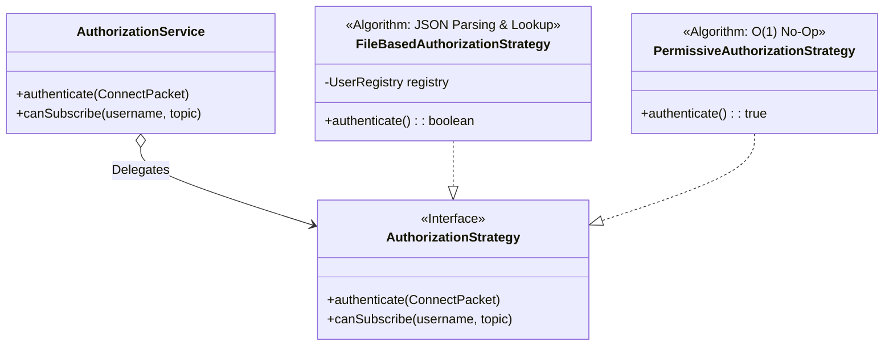

**Pros & Cons**:
*   **Pros**: Isolates security logic (Open/Closed Principle); allows switching between a zero-config "Dev Mode" and strict "Prod Mode" without code changes.
*   **Cons**: Adds slight complexity compared to a simple hardcoded check; requires the `BrokerBuilder` to handle the initialization wiring.

**Future-Proofing & Extensibility**:
*   The true value of this pattern is demonstrated when new authentication requirements arise. For example, integrating **OAuth 2.0** or **LDAP**:
    These would introduce a third algorithm: **Network I/O** (HTTP requests/TCP sockets to external Identity Providers).
    Because the `AuthorizationService` relies on the abstraction, we can implement an `OAuthStrategy` without modifying a single line of the broker's core dispatching code. An `if-else` block would require invasive changes to the core system for every new provider.

#### 2. Session Persistence Strategy

**Location**:

*   **Context (`Context`)**: `src/main/java/com/mqtt/broker/session/SessionManager.java`
*   **Strategy Interface (`Strategy`)**: `src/main/java/com/mqtt/broker/session/persistence/strategy/SessionPersistenceStrategy.java`
*   **Concrete Strategies (`ConcreteStrategy`)**: `FileSessionPersistenceStrategy`, `NoOpSessionPersistenceStrategy`

**Motivation**:
MQTT sessions can be either **ephemeral** (lost on restart) or **durable** (survive restarts). The Strategy Pattern allows us to toggle this architectural characteristic without changing the session management logic.

1.  **No-Op Strategy (Ephemeral)**:
    *   **Algorithm**: No-op.
    *   **Logic**: The `save` method does nothing. `load` returns an empty map. This forces the broker to hold sessions only in RAM (`ConcurrentHashMap`), which is faster but volatile.
    *   **Use Case**: High-throughput scenarios where message durability across restarts is not required.

2.  **File-Based Strategy (Durable)**:
    *   **Algorithm**: Serialization / Deserialization.
    *   **Logic**: Uses `Jackson` to serialize session state (subscriptions, queued messages) to `sessions.json`.
    *   **Use Case**: Reliable messaging where client state must be preserved even if the server crashes.

**Implementation**:
The `SessionManager` acts as the **Context**. It manages active connections but delegates the decision of "how to survive a restart" to the strategy:

```java
public interface SessionPersistenceStrategy {
    void save(Collection<Session> sessions);
    Map<String, Session> load();
}
```


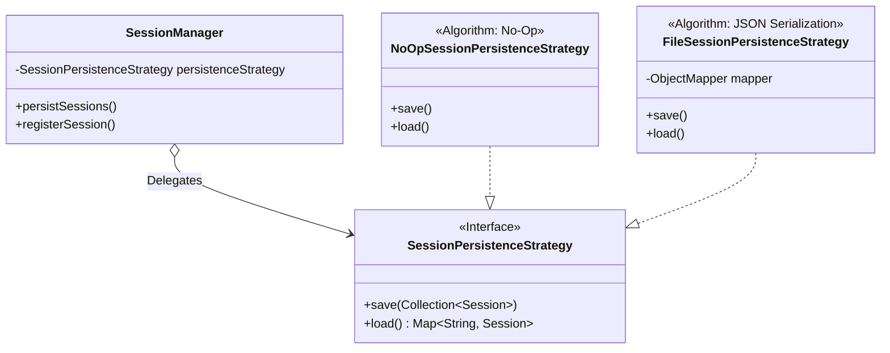

**Pros & Cons (General)**:

*   **Pros**:
    *   **Separation of Concerns**: The core logic (`AuthorizationService`, `SessionManager`) focuses on *what* to do, while the strategies focus on *how* to do it.
    *   **Testability**: We can inject mock strategies (e.g., a `MemoryMapPersistenceStrategy`) during unit tests to verify behavior without creating actual files on disk.
*   **Cons**:
    *   **Indirection**: Navigating the code requires jumping between the interface and its implementations, which can slightly increase cognitive load for new developers.
    *   **Lifecycle Management**: The application (Context) must ensure the strategies are initialized correctly at startup (e.g., ensuring the `sessions.json` file exists or is readable).

### B. Observer Pattern

**Location**:

- **Subject Interface (`Subject`)**: `src/main/java/com/mqtt/broker/event/EventPublisher.java`
- **Concrete Subject (`ConcreteSubject`)**: `src/main/java/com/mqtt/broker/event/BrokerEventPublisher.java`
- **Observer Interface (`Observer`)**: `src/main/java/com/mqtt/broker/event/EventListener.java`
- **Concrete Observers (`ConcreteObserver`)**:
    - `src/main/java/com/mqtt/broker/event/listener/ConnectionEventListener.java`
    - `src/main/java/com/mqtt/broker/event/listener/DeliveryEventListener.java`
    - `src/main/java/com/mqtt/broker/event/listener/SubscriptionEventListener.java`

**Motivation (Architectural Decoupling)**:
The Observer Pattern is implemented to achieve **Inversion of Control (IoC)** regarding system side-effects.
- **Problem**: Tightly coupling the core packet processing logic (e.g., `ConnectPacketHandler`) with auxiliary concerns (Logging, Metrics, Session Cleanup) violates the **Single Responsibility Principle**. It renders the core difficult to test and maintain.
- **Solution**: We introduce an event-driven architecture where core components act as **Subjects** that broadcast state changes (`BrokerEvent`) without knowledge of the consumers. **Observers** (`EventListener`) subscribe to these events, allowing functionality to be composed dynamically.

**Implementation Details**:
The system employs a synchronous, explicitly modeled Observer implementation:

1.  **Subject Definition**: The `BrokerEventPublisher` maintains a registry (`List<EventListener>`) of active subscribers using **Aggregation**.
2.  **Subscription Mechanism**: During application bootstrap, dependent components register themselves via the `addListener()` method.
3.  **Synchronous Dispatch**: When a `publish(event)` call is triggered, the Subject iterates sequentially through its registry. It invokes the `onEvent(event)` method on each listener, passing the immutable `BrokerEvent` context.
    *   *Note*: This implementation is **synchronous**, meaning the publisher blocks until all listeners complete. This ensures data consistency but requires listeners to be non-blocking I/O safe.


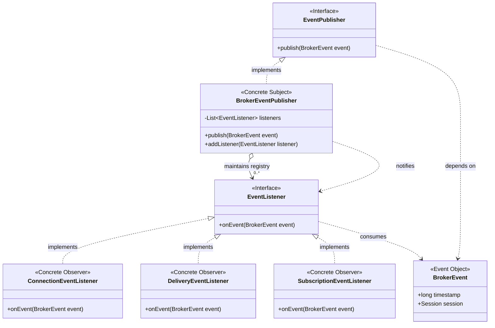

**Pros & Cons**:
*   **Pros**:
    *   **Loose Coupling**: The publisher (Subject) has no compile-time dependency on concrete listeners. New functionality (e.g., Auditing) can be added by simply implementing a new `EventListener` class.
    *   **Dynamic Composition**: Subscribers can be attached or detached at startup (or runtime) based on configuration.
*   **Cons**:
    *   **Synchronous Latency**: Since dispatch is synchronous, a slow listener will block the main processing thread, potentially degrading broker throughput.
    *   **Lapsed Listener Problem**: If listeners are not explicitly unregistered (though less relevant in a server singleton lifecycle), it can lead to memory leaks.
    *   **Indeterministic Ordering**: The order of notification is technically undefined (dependent on list insertion), implying listeners must be independent of one another.

### C. Command Pattern (Dispatcher)

**Location**:

- **Invoker (`Invoker`)**: `src/main/java/com/mqtt/broker/handler/MqttPacketHandler.java`
- **Command Interface (`Command`)**: `src/main/java/com/mqtt/broker/handler/PacketHandler.java`
- **Concrete Commands (`ConcreteCommand`)**: `ConnectPacketHandler`, `PublishPacketHandler`, etc.
- **Receiver (`Receiver`)**: `AuthorizationService`, `SessionManager`, `TopicTree`, etc.
- **Client (`Client`)**: `BrokerBuilder` (Configuration & wiring).

**Motivation (Encapsulation of Requests)**:
The Command Pattern allows us to turn a request (a network packet) into a stand-alone object that contains all information about the request.
- **Problem**: A massive `switch` statement in the main network loop would violate the **Open/Closed Principle** and create a "God Class" coupled to every business logic service.
- **Solution**: We encapsulate the handling logic into separate **Command** objects (`PacketHandler` implementations). The **Invoker** (`MqttPacketHandler`) merely identifies the packet type and triggers the corresponding command's `handle()` method, without knowing the execution details.

**Implementation Details**:
1.  **Command Interface**: The functional interface `PacketHandler<T>` declares the `handle(channel, packet)` method.
2.  **Concrete Commands**: Classes like `ConnectPacketHandler` implement this interface. They are pre-configured with references to necessary **Receivers** (e.g., `SessionManager`) via constructor injection.
3.  **Invoker Execution**: `MqttPacketHandler` stores a map (or fields) of these commands. When a packet arrives, it delegates execution: `handler.handle(channel, packet)`.


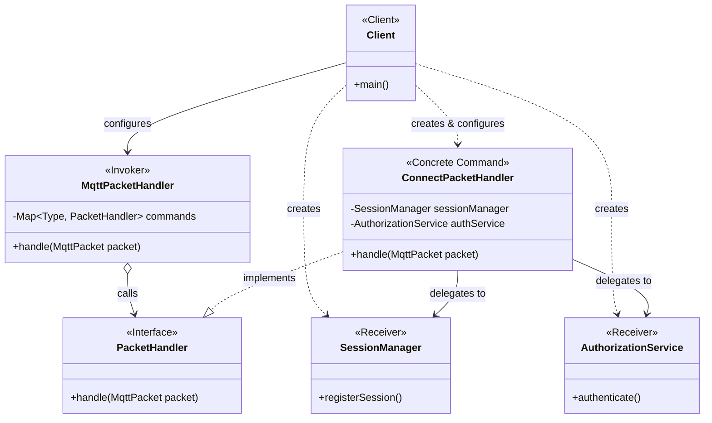

**Pros & Cons**:
*   **Pros**:
    *   **Open/Closed Principle**: New packet types (e.g., for MQTT 5.0) can be added by creating a new `PacketHandler` implementation without modifying existing logic.
    *   **Single Responsibility**: Each handler class focuses solely on one specific packet type's logic.
*   **Cons**:
    *   **Class Explosion**: Each operation requires a separate class, increasing the total file count significantly.
    *   **Object Overhead**: Creating a command object (or maintaining singletons) adds a layer of abstraction compared to a direct method call.

### D. Chain of Responsibility Pattern (Pipeline)

**Location**:

- **Handler Interface (`Handler`)**: `src/main/java/com/mqtt/broker/pipeline/interceptor/Interceptor.java`
- **Base Handler (`BaseHandler`)**: `src/main/java/com/mqtt/broker/pipeline/interceptor/ChainablePacketInterceptor.java`
- **Pipeline Manager / Client**: `src/main/java/com/mqtt/broker/pipeline/PacketProcessingPipeline.java`
- **Concrete Handlers (`ConcreteHandler`)**: `ResponseSendingInterceptor`, `EventPublishingInterceptor`, `ClientActivityInterceptor`,
  `PacketAuthorizationInterceptor`, `PacketHandlingInterceptor`

**Motivation (Dynamic Processing Pipeline)**:
The Chain of Responsibility pattern creates a sequential processing pipeline where each component has the opportunity to process a request or pass it to the next handler.
- **Problem**: Hardcoding the order of operations (Auth -> RateLimit -> Audit -> Process) inside a single method results in rigid, unmaintainable code. Reordering or adding steps requires modifying the core logic.
- **Solution**: We decompose the processing steps into independent **Interceptors**. Each interceptor focuses on a single task (e.g., "Authorize Packet"). A **Base Handler** manages the linkage between them. The **Client** composes these handlers into a runtime chain.

**Implementation Details**:
1.  **Handler Interface**: The `Interceptor` interface defines the `intercept(channel, packet)` method and the `setNext()` method.
2.  **Base Handler**: `ChainablePacketInterceptor` implements the boilerplate "pass-through" logic:
    ```java
    // Boilerplate logic in Base Handler
    if (result.isPresent()) return result.get();
    if (next != null) return next.intercept(channel, packet);
    return ProcessingResult.empty();
    ```
3.  **Concrete Handlers**: Classes like `PacketAuthorizationInterceptor` extend the base handler. They perform specific checks. If a check fails (e.g., unauthorized), they return a result immediately (short-circuiting). If it passes, they return `Optional.empty()`, causing the Base Handler to delegate to the `next` interceptor.
4.  **Client Composition**: The `Pipeline.Builder` dynamically links these interceptors at startup, allowing us to easy reconfigure the pipeline order in `BrokerBuilder`.


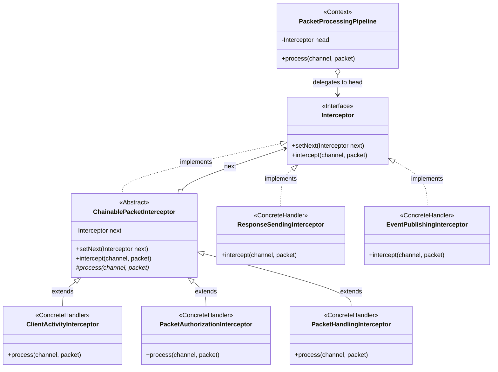

**Pros & Cons**:
*   **Pros**:
    *   **Dynamic Reordering**: The processing order is defined by the configuration (Builder), not the code structure.
    *   **Single Responsibility**: Each interceptor does one thing well (e.g., Auth, Logging).
    *   **Decoupling**: The sender (Broker) does not know which handler will process the request.
*   **Cons**:
    *   **Performance Overhead**: Passing a request down a long chain involves many method calls.
    *   **Silent Failures**: If the chain isn't configured correctly, requests might be dropped.
    *   **Debugging Complexity**: Hard to trace the exact path of a packet through dynamic layers.

### E. Builder Pattern

**Location**:

- **Broker Builder**: `src/main/java/com/mqtt/broker/BrokerBuilder.java`
- **Pipeline Builder**: `src/main/java/com/mqtt/broker/interceptor/PacketProcessingPipeline.java` ($Builder)
- **Event Publisher Builder**: `src/main/java/com/mqtt/broker/event/BrokerEventPublisher.java` ($Builder)

**Motivation (Construction Complexity)**:
The Builder Pattern separates the construction of a complex object from its representation, allowing the same construction process to create different representations.
- **Problem**: Validating and initializing a `Broker` requires coordinating 7+ dependencies (Context, Selector, Pipeline, etc.). A "Telescoping Constructor" (many distinct constructor overloads) is unreadable and error-prone.
- **Solution**: We use **Fluent Builders**. The Client (Main class) acts as the **Director**, configuring the steps. The **Builder** ensures the final **Product** is in a valid state (no missing dependencies) before instantiation.

**Implementation Variations**:
Our project employs three distinct variations of the pattern:

#### 1. Broker Initialization (Standard Builder)
The `BrokerBuilder` constructs the singleton `Broker` instance by wiring together all the other services.

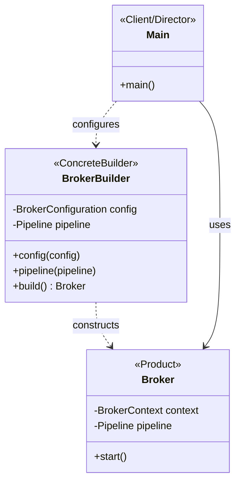

#### 2. Pipeline Assembly (Chain Builder)
The `PacketProcessingPipeline.Builder` is specialized for constructing a linked structure (Chain of Responsibility). It handles the complexity of linking `head` and `tail` pointers.

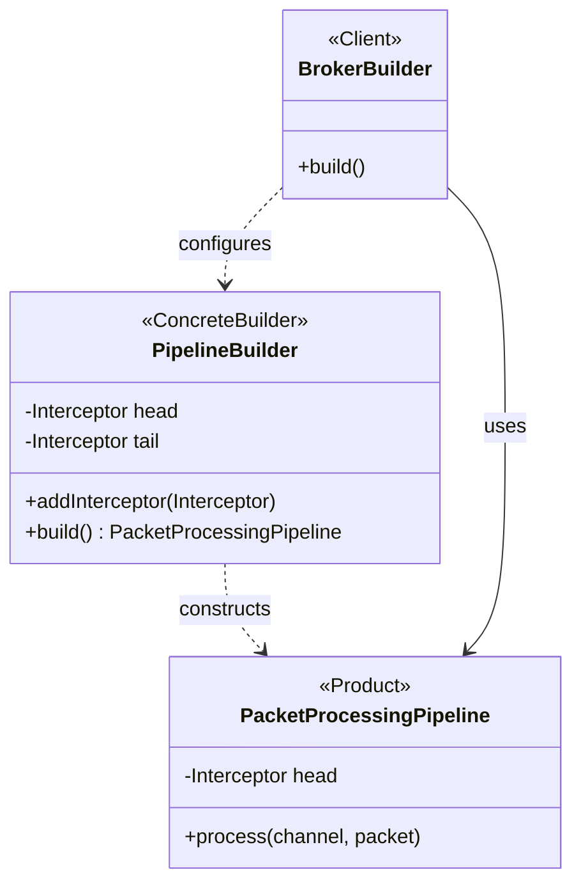

#### 3. Event Publisher Registry (Collection Builder)
The `BrokerEventPublisher.Builder` aggregates a collection of listeners before sealing them into an immutable list in the final product.

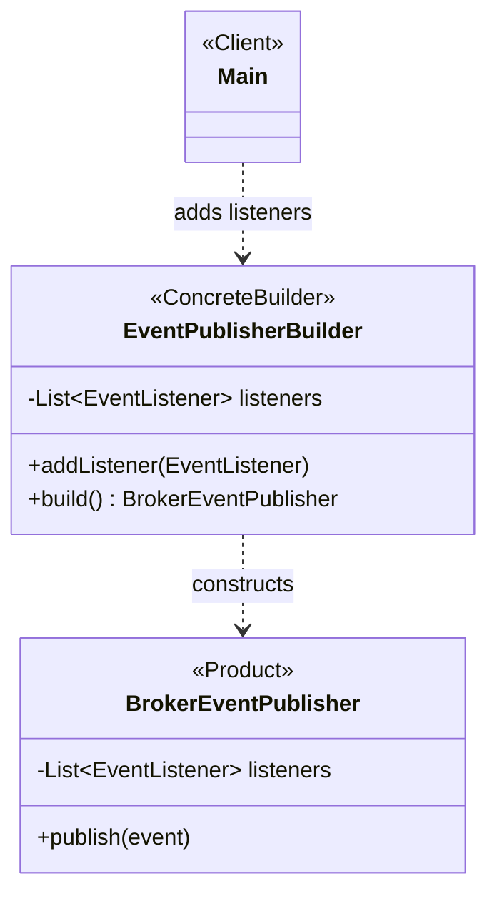

**Pros & Cons**:
*   **Pros**:
    *   **Immutability**: Products (`Broker`, `Pipeline`) can be immutable once built, as all setup happens in the builder.
    *   **Readability**: Fluent APIs (`.config().pipeline().build()`) read like natural language.
    *   **Validation**: The `build()` method acts as a gateway to check for missing required fields (e.g., throwing `IllegalStateException`).
*   **Cons**:
    *   **Code duplication**: Requires mirroring fields between the Builder and the Product classes.
    *   **Verbosity**: Increases the codebase size for objects that might otherwise be simple POJOs.

## 4. Visual Diagrams (UML)

### A. UML Class Diagram (Core System)

This diagram highlights the relationship between the central Broker, the networking layer, and the core processing
components.

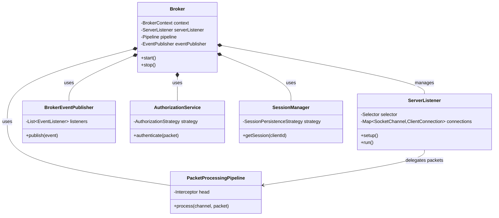

### B. Sequence Diagram: Client Connection Flow

This diagram illustrates the interaction between components when a client connects.

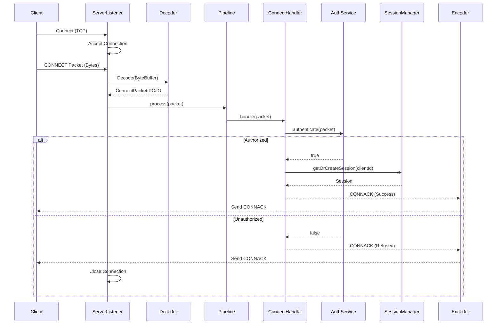

### C. Activity Diagram: Packet Processing Pipeline

The lifecycle of an incoming packet from network read to response.

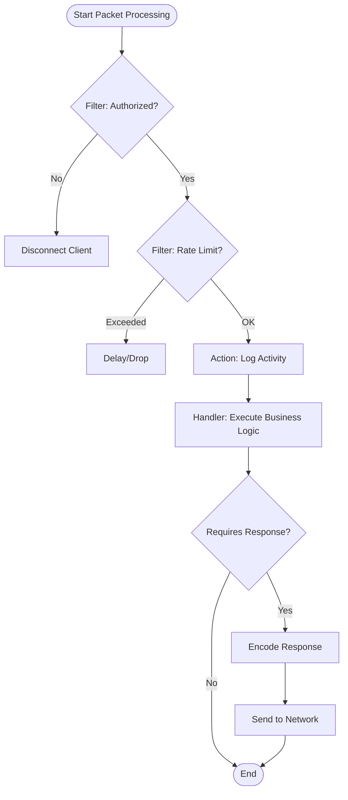

## 5. Configuration & Persistence

The broker behavior is controlled via configuration files and persistent storage located in the root directory.

### Configuration (`config.yml`)

Located at the **project root**. Controls server settings.

* **host**: The hostname or IP address to bind to (default: 'localhost').
* **allowAnonymous**:
    * `true`: No credentials required.
    * `false`: Validates against `users.json`.
* **port**: The TCP port (default: 1883).
* **cleanSession**:
    * `true`: The broker does not store any session information for the client. All information from previous connections is cleaned up.
    * `false`: The broker stores session information (subscriptions, queued messages) for the client.

### User Repository (`users.json`)

Used when `allowAnonymous: false`. Defines valid users and their topic permissions.

```json
[
  {
    "username": "user",
    "password": "password",
    "permissions": [
      {
        "topic": "readwrite/#",
        "access": "READ_WRITE"
      }
    ]
  }
]
```

### Session Repository (`sessions.json`)

Used to persist client sessions across broker restarts.

```json
[
  {
    "clientId": "client123",
    "username": "user",
    "cleanSession": false,
    "subscriptions": {
      "readwrite/#": "EXACTLY_ONCE"
    },
    "pendingMessages": [],
    "nextPacketId": 1
  }
]
```

### Session Persistence (`sessions.json`)

Stores active sessions, subscriptions, and queued messages. This ensures that if the broker restarts, persistent
sessions (clients with `cleanSession=false`) do not lose their state or queued messages. This file is updated at runtime
by the `SessionPersistenceService`.

## 6. Running the Broker

### Prerequisites

* Java 25 (Project configured for Java 25 features).
* Maven (Wrapper included).

### Execution Steps

1. **Clone the repository**:
   ```bash
   git clone <repository-url>
   cd mqtt-broker
   ```

2. **Run the application**:
   Use the Maven wrapper to clean, compile, and execute the main class.

   **On macOS / Linux**:
   ```bash
   ./mvnw clean compile exec:java
   ```

   **On Windows**:
   ```cmd
   mvnw.cmd clean compile exec:java
   ```

The broker will start up and log "Broker started on port 1883".

## 7. Testing

To verify functionality, use an MQTT Client like **MQTTX**:

1. Open MQTTX.
2. Create a connection to `localhost` on port `1883`.
3. If `allowAnonymous: false`, provide a username/password from `users.json`.
4. Connect and try publishing/subscribing to topics.
